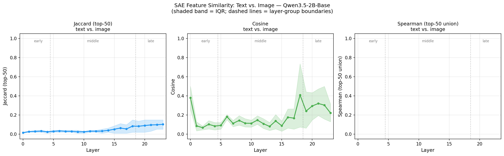
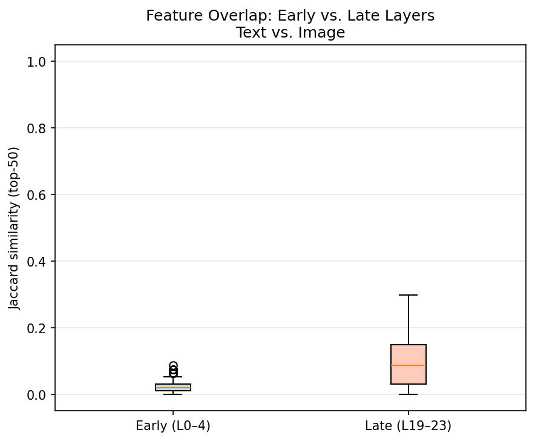

# Do Vision and Text Live in the Same Space? Probing Qwen3.5-2B-Base with SAE Features

Interpretability experiment using Sparse Autoencoders to measure how truly multimodal Qwen3.5-2B-Base is.

## TL;DR

We sent 200 prompts through Qwen3.5-2B-Base, once as plain text, once as a rendered image of the same text and measured whether the model activates the same internal SAE features at each of its 24 transformer layers.

The short answer: no, not really, but a little eventually.

Text and image representations stay almost entirely separate through the first 18 layers, then partially converge in the final layers, peaking at a median Jaccard similarity of ~10% and cosine similarity of ~30%. The model's internal language of "what this input means" is not yet modality-agnostic, even at the deepest layers.

## Background

### The question

Qwen3.5-2B-Base processes both text and images through the same transformer backbone. A vision encoder embeds image patches, a merger projects them into the language model's residual stream dimension, and the 24-layer language model takes over from there. In principle, both modalities are speaking the same language after the first few tokens.

But do they really? If you show the model a photo of the sentence "The speed of light is approximately 3×10⁸ m/s" versus typing that sentence directly, does the model internally recognise them as the same thing?

This question matters beyond curiosity. If vision and language representations converge internally, you can expect the model's reasoning, knowledge, and safety behaviors to generalise across modalities. If they stay separate, a capability you tested on text may not transfer to images and vice versa.

### Sparse Autoencoders as a interpretability lens

The [Qwen Scope](https://huggingface.co/Qwen/SAE-Res-Qwen3.5-2B-Base-W32K-L0_50) project provides a Sparse Autoencoder (SAE) trained on the residual stream of each of the 24 transformer layers of Qwen3.5-2B-Base. Each SAE learns to decompose the 1024-dimensional residual stream into a sparse combination of 32,768 interpretable features, keeping the top-50 active per token.

SAEs are a natural tool here: instead of comparing raw activation vectors (which are dense and entangled), we compare which features are active - a much more interpretable signal. Two inputs are "similar" if they light up the same features, regardless of exact activation magnitudes.

## Method

### Dataset - `UlrickBL/vision_scope_prompts`

We built a dataset of 200 prompts spanning 10 knowledge domains (biology, math, physics, chemistry, history, geography, literature, cs, linguistics, arts), in two languages:

- 100 English prompts - mix of completion starters ("The powerhouse of the cell is...") and direct questions ("What is the half-life of carbon-14?")
- 100 French prompts - semantic equivalents, not literal translations

Each prompt exists in two forms:

| Modality | What the model sees |
|---|---|
| **Text** | The prompt string, tokenized normally |
| **Image** | A clean PNG rendering of the same text (white background, black font) |

The dataset is available on the Hugging Face Hub: [`UlrickBL/vision_scope_prompts`](https://huggingface.co/datasets/UlrickBL/vision_scope_prompts)

| Column | Description |
|---|---|
| `id` | `{idx:03d}_{lang}`, e.g. `007_fr` |
| `language` | `en` or `fr` |
| `topic` | One of 10 knowledge topics |
| `text` | The prompt string |
| `image` | PNG rendering of the text |

### Feature extraction

For each of the 200 prompts × 2 modalities = 400 forward passes, we:
1. Register hooks on all 24 transformer layers of `Qwen/Qwen3.5-2B-Base`
2. Capture the residual stream at the **last token** after each layer
3. Apply the corresponding SAE: `pre_acts = residual @ W_enc.T + b_enc`, then keep top-50

The result is a sparse vector in ℝ³²⁷⁶⁸ per (prompt, modality, layer) - 200 × 2 × 24 = 9,600 vectors total.

### Similarity metrics

For each (prompt, layer) pair, we compare the text and image sparse vectors with three metrics:

| Metric | Formula | What it measures |
|---|---|---|
| **Jaccard** | \|A ∩ B\| / \|A ∪ B\| | Do the same features fire at all? |
| **Cosine** | a · b / (‖a‖ ‖b‖) | Are activation magnitudes aligned? |
| **Spearman ρ** | rank correlation over union(top-50) | Do the same features fire *in the same order of importance*? |

**Random baseline:** with 32,768 features and 50 active, two random vectors have an expected Jaccard of ≈ 0.15%. Anything above ~5% is a meaningful signal.

## Results

### Overall convergence



Three regimes emerge clearly:

**Early layers (L0–4): near-zero overlap.**
Jaccard sits at ~2%, cosine at ~10–15%. The model is in the middle of very different processing pipelines: text tokens are going through standard token embedding; image patches are being absorbed from the vision merger. The representations are modality-specific at this stage.

**Middle layers (L5–18): slow, noisy increase.**
Both Jaccard and cosine drift upward, but stay low (Jaccard < 5%, cosine < 20%). The IQR band is wide, meaning some prompt-pairs show meaningful similarity while most do not. There is no single "fusion layer" - it is a gradual, heterogeneous process.

**Late layers (L19–23): partial convergence.**
Jaccard reaches ~10% (median), cosine reaches ~20–30%, with a notable spike around layer 18. The model builds some shared representation by the end, but the overlap is still modest. A Jaccard of 10% means text and image share only ~5 of their top-50 features on average.

The cosine spike at layer 18 is the most striking feature of the results. To understand it, the architecture matters. Qwen3.5-2B-Base uses a strict repeating pattern across its 24 language model layers: **three `GatedDeltaNet` layers followed by one standard `Attention` layer**, six times over:

```
L0:  GatedDeltaNet
L1:  GatedDeltaNet
L2:  GatedDeltaNet
L3:  Attention
L4:  GatedDeltaNet
L5:  GatedDeltaNet
L6:  GatedDeltaNet
L7:  Attention
L8:  GatedDeltaNet
L9:  GatedDeltaNet
L10: GatedDeltaNet
L11: Attention
L12: GatedDeltaNet
L13: GatedDeltaNet
L14: GatedDeltaNet
L15: Attention
L16: GatedDeltaNet
L17: GatedDeltaNet
L18: GatedDeltaNet   ← cosine spike at output
L19: Attention
L20: GatedDeltaNet
L21: GatedDeltaNet
L22: GatedDeltaNet
L23: Attention
```

`GatedDeltaNet` is a linear (subquadratic) recurrent-style attention: it processes tokens through a learned delta-rule update and a gated state, which is efficient but inherently local - it accumulates context sequentially without full cross-sequence visibility. Standard `Attention` is full quadratic self-attention over all sequence positions simultaneously.

Layer 18 is the **last GatedDeltaNet in the 5th block**, immediately feeding into the 5th standard Attention layer at L19. A plausible reading: the three GatedDeltaNet layers (L16–18) act as a compression and alignment stage that brings text and image residuals into a more compatible geometry, and the full-attention layer at L19 then has enough cross-position visibility to enforce a shared representation. What we capture at the output of L18 is the residual stream just before that reconciliation step - already shifted, but not yet fully mixed.

Notably, the same [3 linear + 1 attention] boundary exists at L3, L7, L11, and L15, yet none of those produce a comparable spike. This suggests the effect is not purely architectural but also depends on depth: by layer 18, enough semantic abstraction has accumulated that the GatedDeltaNet block can meaningfully align the two modalities in a way the earlier blocks cannot.

### Early vs. late: the shift is real, but small



The late-layer distribution is clearly shifted upward and more variable than the early-layer distribution. Some prompts achieve Jaccard ~0.3 in the late layers - these are cases where the model genuinely builds a shared internal representation. But the median stays below 0.1, and many prompt-pairs never converge (Jaccard ~0, cosine has some differences in last layers).

### Language makes almost no difference


English and French curves are nearly identical across all 24 layers and all three metrics. The convergence pattern is language-agnostic: whatever modality gap exists in the model's representations, it is not amplified or reduced by the input language.

### Topics: uniformly low, no outliers


The heatmap is almost entirely red. Every topic - from concrete STEM domains (math, physics, chemistry) to abstract ones (literature, arts) - shows the same low text-image similarity across all layers.

This is somewhat surprising. One might expect mathematical notation (which looks the same on paper and in text) to converge faster than prose. But the representations in the language model's residual stream appear to be driven by the *modality of the input* more than by the *type of content* it contains - at least at this granularity.

## Interpretation

The overall picture is of modality-specific processing throughout most of the network, with only partial and late convergence.

A few things this might mean:

1. The vision encoder is doing its job, but not overcoming the modality gap. The merger maps image patches into the language model's embedding space, but that does not mean the resulting tokens are treated the same as text tokens. They carry different positional patterns, different attention histories, and different feature statistics.

2. The hybrid attention architecture may matter. Qwen3.5-2B-Base uses a mix of GatedDeltaNet (linear attention) and standard attention layers. The cosine spike at layer 18 coincides with a transition point in this architecture. It is possible that standard attention layers are better at "reconciling" representations from different input modalities.

3. Last-token pooling is a limitation. For text inputs (~15–30 tokens), the last token has a focused summary of the prompt. For image inputs (~300 patch tokens), the last token has attended over a much larger context. The representations we compare may not be fully equivalent pooling positions.

4. 10% Jaccard at layer 23 is non-trivial. The random baseline is 0.15%. A 10% overlap means the model has found ~5 features that are genuinely modality-invariant for these inputs. With more layers or a larger model, this may grow substantially.

## Limitations

- **200 samples.** The dataset is small enough that topic-level differences may be noise rather than signal. A 10× larger dataset would allow cleaner per-topic and per-layer statistics.
- **Last-token pooling.** Mean-pooling over the full sequence is a natural alternative, especially for image inputs where multiple patch tokens may carry the key information.
- **Base model only.** Fine-tuned instruction models may show different convergence patterns if post-training encouraged the model to treat modalities more uniformly.
- **Image as rendered text.** Our image inputs are PNG renderings of text - essentially a soft OCR task. This is a deliberately controlled setup, but it does not reflect the full distribution of natural images the model was trained on.

## Conclusion

Qwen3.5-2B-Base sees text and images through largely separate circuits across most of its 24 layers. By the final layers, a modest but statistically meaningful convergence emerges - roughly 10% feature overlap (versus a 0.15% random baseline) - suggesting the model does build *some* shared internal language. But calling it "truly multimodal" in the mechanistic sense would be an overstatement at the current scale.

Maybe the Deepseek's method of incorporating vision from pretraining and kimi K2.5 joint text-vision pre-training and joint text-vision reinforcement learning could improve features correlation.

The most interesting signal is the **cosine spike at layer 18**, which hints at a structural transition point in the network where modality boundaries begin to blur. Follow-up work could investigate whether this corresponds to specific attention heads, whether it is present in larger Qwen3.5 variants, and whether it strengthens with instruction tuning.

## References

- Qwen3.5 model family: [Qwen Blog](https://qwenlm.github.io/)
- Qwen Scope SAE: [`Qwen/SAE-Res-Qwen3.5-2B-Base-W32K-L0_50`](https://huggingface.co/Qwen/SAE-Res-Qwen3.5-2B-Base-W32K-L0_50)
- Qwen Scope Technical Report: [arXiv 2605.11887](https://arxiv.org/abs/2605.11887)
- Dataset: [`UlrickBL/vision_scope_prompts`](https://huggingface.co/datasets/UlrickBL/vision_scope_prompts)
