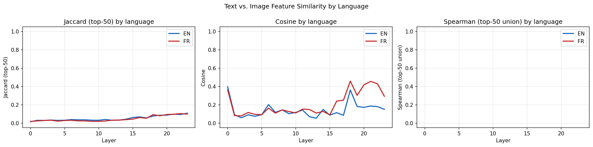
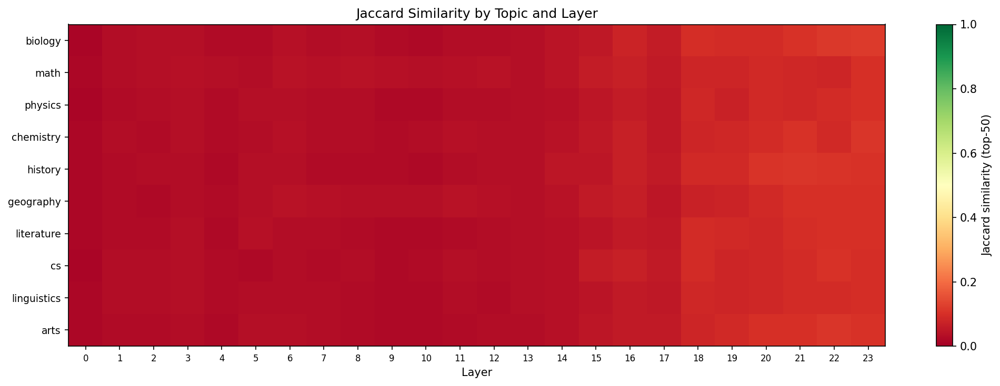
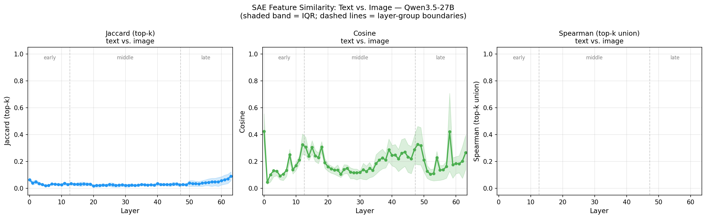
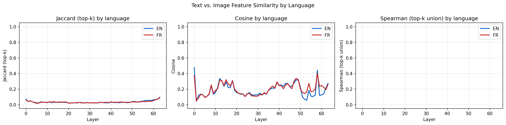
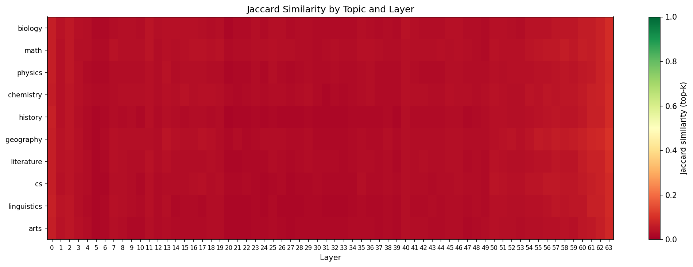
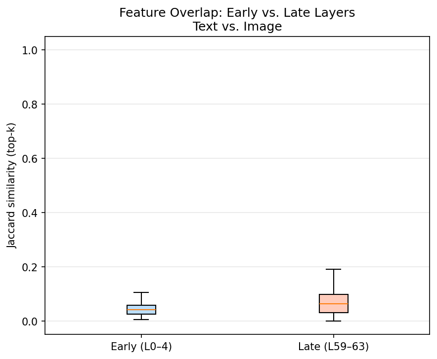

# How Multimodal is Qwen3.5 ? Probing Text-Image Convergence with SAE Features

_Two experiments on the Qwen3.5 model family (a small base model and a larger instruct model) using Sparse Autoencoders to look inside the residual stream layer by layer._

## TL;DR

I sent 200 prompts through two Qwen3.5 models - each twice, once as plain text and once as a rendered image of the same text - and measured whether the model activates the same SAE features at each transformer layer.

Two experiments with the output for tested models: **text and image representations stay largely separate throughout both models. Instruction tuning dramatically improves geometric alignment (cosine), but leaves the discrete feature overlap (Jaccard) almost unchanged.**

## Background

### The question

Qwen3.5 models are natively multimodal: a vision encoder embeds image patches, a merger projects them into the language model's residual stream, and the same transformer backbone processes both. In principle, after that projection, both modalities should be "speaking the same language."

But do they? If you show the model a photo of _"The speed of light is approximately 3×10⁸ m/s"_ versus typing that sentence, does it internally recognize them as the same thing - or does it route them through different circuits that never fully merge?

This matters practically. If text and image representations converge internally, capabilities, safety behaviors, and knowledge generalise across modalities. If they stay separate, a model that reasons well about a textual question may not do the same when the same question arrives as an image.

### Sparse Autoencoders

The [Qwen Scope](https://huggingface.co/Qwen/SAE-Res-Qwen3.5-2B-Base-W32K-L0_50) project trained a Sparse Autoencoder (SAE) on the residual stream of each transformer layer of several Qwen3.5 models (mainly base models). Each SAE decomposes the dense residual vector into a sparse combination of interpretable features, keeping only the top-k active per token.

This gives us a cleaner comparison than raw activations: instead of asking "are these vectors similar?", we ask "do they activate the same features?" which is a more interpretable signal that ignores entangled directions in activation space.

## Why these two models

The Qwen Scope project has released SAE checkpoints for different variants of Qwen3.5 and I selected these 2 :

| Model                  | Layers | SAE features | Top-k | Released           |
| ---------------------- | ------ | ------------ | ----- | ------------------ |
| `Qwen/Qwen3.5-2B-Base` | 24     | 32,768       | 50    | Base model SAE     |
| `Qwen/Qwen3.5-27B`     | 64     | 80,000       | 100   | Instruct model SAE |

I would have preferred to compare base-vs-base or instruct-vs-instruct to isolate the effect of post-training. That is not possible with currently public checkpoints: the 27B-Base is not on HuggingFace, and there is no instruct SAE for the 2B. Running the full 27B pipeline - model weights (~55 GB) plus SAE checkpoints for all 64 layers (~3.5 GB each, 64 of them) - costs roughly **$2/h on a GPU**, making systematic ablations expensive.

The two experiments therefore conflate scale (2B vs 27B) with training regime (base vs instruct). Let's keep this in mind throughout and avoid overclaiming about which factor drives the differences.

## Method

### Dataset - `UlrickBL/vision_scope_prompts`

200 prompts across 10 knowledge domains (biology, math, physics, chemistry, history, geography, literature, cs, linguistics, arts), in two languages:

- **100 English** - mix of completion starters (_"The powerhouse of the cell is…"_) and direct questions (_"What is the half-life of carbon-14?"_)
- **100 French** - semantic equivalents, not literal translations

Each prompt exists in two forms:

| Modality  | What the model sees                                                   |
| --------- | --------------------------------------------------------------------- |
| **Text**  | The prompt string, tokenized directly                                 |
| **Image** | A clean PNG rendering of the same text (white background, black font) |

### Feature extraction

For each prompt × modality × layer, we:

1. Register a forward hook on the transformer layer
2. Capture the residual stream at the **last token** position
3. Apply the corresponding SAE: `pre_acts = residual @ W_enc.T + b_enc`, keep top-k

This produces one sparse vector per (prompt, modality, layer). We then compare the text and image vectors for each prompt at each layer.

### Metrics

| Metric      | What it asks                                                         |
| ----------- | -------------------------------------------------------------------- |
| **Jaccard** | Do the same features fire? - `\|A ∩ B\| / \|A ∪ B\|` over top-k      |
| **Cosine**  | Do the activations point in the same direction? - full sparse vector |

**Random baseline:** two independent random sparse vectors with top-50 active out of 32,768 features have an expected Jaccard of ~0.15%. Anything above ~5% is meaningful signal.

Spearman correlation did not plot well so just ignore this part of the plots.

## Experiment 1 - Qwen3.5-2B-Base

### Overall convergence


Three regimes emerge:

**Early layers (L0–4): near-zero overlap.** Jaccard ~2%, cosine ~10–15%. Text and image are in completely different processing contexts: text tokens come from the embedding table, image patch tokens from the vision merger. The representations are modality-specific.

**Middle layers (L5–18): slow drift upward.** Both metrics inch up but stay low (Jaccard < 5%, cosine < 20%). The IQR band is wide - some prompt-pairs accumulate meaningful similarity while most do not. There is no single fusion layer.

**Late layers (L19–23): partial convergence.** Jaccard peaks at ~10% median, cosine at ~20–30%. A Jaccard of 10% means text and image share only ~5 of their top-50 features on average - modest, but 70× the random baseline.

### The architecture explains the spike

The most striking feature is the **cosine spike at layer 18**. Qwen3.5-2B-Base's 24-layer backbone follows a strict `[3× GatedDeltaNet + 1× Attention]` pattern, repeated six times:

```
L0–2:  GatedDeltaNet  →  L3:  Attention
L4–6:  GatedDeltaNet  →  L7:  Attention
L8–10: GatedDeltaNet  →  L11: Attention
L12–14: GatedDeltaNet →  L15: Attention
L16–18: GatedDeltaNet →  L19: Attention  ← spike at L18 output
L20–22: GatedDeltaNet →  L23: Attention
```

`GatedDeltaNet` is a linear recurrent-style attention: efficient but inherently local, accumulating context sequentially without full cross-sequence visibility. Standard `Attention` performs global quadratic self-attention across all positions simultaneously.

Layer 18 is the last GatedDeltaNet in the 5th block, immediately feeding into the 5th global Attention layer at L19. The three GatedDeltaNet layers (L16–18) appear to compress and align the text and image residuals into a more compatible geometry, just before L19's full attention can exploit that alignment. Notably, the same structural boundary exists at L3, L7, L11, and L15 without producing a comparable spike - the effect depends on depth, not just architecture.

### Language and topic don't matter



English and French curves are nearly identical at every layer. The modality gap is language-agnostic.



The heatmap is almost entirely red. Every topic - STEM or humanities, abstract or concrete - shows the same low text-image similarity. Modality dominates over content in determining which features fire.

### Early vs. late


The late-layer distribution is clearly shifted up and wider than early layers. Some prompts reach Jaccard ~0.3, meaning the model genuinely builds a shared representation for those inputs. The median stays below 0.1.

## Experiment 2 - Qwen3.5-27B (Instruct)

Same experiment, 64-layer instruct model, 80K-feature SAE with top-100.

### Overall convergence



The picture splits dramatically along metric lines.

**Cosine is dramatically higher and more active.** Where the 2B-Base's cosine collapsed after layer 0 and barely recovered, the 27B-Instruct sustains ~20–30% through the middle layers and produces multiple prominent spikes - around L12–13, L20, L48–50, and a peak at L60 reaching ~0.65. The model's text and image representations are geometrically much more aligned throughout the full depth.

**Jaccard stays similarly low.** The specific features that fire remain mostly modality-specific. Early layers start slightly higher (~5% vs ~2%), but late-layer Jaccard peaks at only ~8% - actually below the 2B-Base's ~10%. The increase from early to late is a smaller delta than in the 2B (5%→8% vs 2%→10%).

**Multiple cosine spikes, not one.** The same [3 GatedDeltaNet + 1 Attention] pattern extended to 64 layers places Attention layers at L3, L7, L11, ..., L59, L63. The 27B shows cosine peaks roughly tracking these transitions - each global Attention layer temporarily reconciles the representations before the next GatedDeltaNet block disperses them. What was a single spike in the 2B becomes a recurring pulse across the full depth.

### Language and topic



Language parity holds. EN and FR track closely in both Jaccard and cosine throughout all 64 layers, with minor divergences only in a few late cosine spikes.



Still almost entirely red. Slightly more heterogeneous than the 2B-Base in early layers, but no topic emerges as a consistent outlier.

### Early vs. late



The early-to-late shift in Jaccard is real but small: L0–4 median ~5%, L59–63 median ~7–8%. The 2B-Base showed a more pronounced progression (2%→10%); here the model starts higher but plateaus earlier.

## What the comparison reveals

Putting the two experiments side by side:

|                             | 2B-Base | 27B-Instruct                         |
| --------------------------- | ------- | ------------------------------------ |
| Layers                      | 24      | 64                                   |
| Late-layer Jaccard (median) | ~10%    | ~8%                                  |
| Middle-layer Cosine (mean)  | ~12%    | ~22%                                 |
| Cosine spikes               | 1 (L18) | Multiple (tracking Attention layers) |
| EN vs FR gap                | None    | None                                 |
| Topic structure             | None    | None                                 |

**Cosine is sensitive to post-training (or scale); Jaccard is not.**

The 27B-Instruct's representations are geometrically much more aligned - they point in similar directions in the SAE feature space. But the specific features that fire are barely more similar than in the 2B-Base. Instruction tuning (and possibly scale) shapes the _direction_ of representations without unifying the _vocabulary_ of features.

One way to read this: the instruct model has learned to respond coherently to both modalities, which requires their representations to be semantically compatible. That pushes cosine similarity up. But the SAE features are a finer-grained decomposition - they capture which specific concepts, syntactic roles, or low-level patterns are active, and those remain largely modality-specific even after post-training.

An analogy: two speakers who have learned to agree on every topic (high cosine) but still phrase things in completely different ways (low Jaccard). The shared understanding is real, but the internal vocabulary is different.

**The recurring spikes tell a structural story.** In both models, cosine peaks just before or at global Attention layers - positions where full cross-sequence mixing is possible. The GatedDeltaNet blocks accumulate and align; the Attention layers reconcile. The 27B has more of these reconciliation checkpoints, which may explain why its cosine stays higher between them.

**The confound we cannot resolve.** The 27B-Instruct differs from the 2B-Base in both scale (13× more parameters, more layers, higher-dimensional SAE) and training regime (SFT/RL on top of a base model). We cannot attribute the cosine improvement to one or the other. A 27B-Base SAE would isolate scale; a 2B-Instruct SAE would isolate post-training. Neither is currently public.

**Qwen's training choice may be the deeper explanation.** Qwen3.5 follows a common but constrained recipe: train a powerful language model on text, then bolt on a vision encoder and fine-tune on multimodal data. The language backbone arrives at multimodal training already deeply specialised - its features, circuits, and residual stream geometry are optimised for language. Vision is then projected into that space, but the projection is a learned adapter, not a shared pretraining signal. The language model's internal vocabulary was never shaped by images.

This is in contrast to models that incorporate vision from the very beginning of pretraining. Kimi K2.5 is trained with joint text-vision pretraining and joint text-vision reinforcement learning, both modalities are present throughout the full training signal (or at least way sooner), which forces the model to develop shared representations from the ground up. DeepSeek "thinking with vision", with its multimodal reasoning approach, similarly integrates visual thinking at the pretraining stage rather than treating it as an add-on. The hypothesis is that when both modalities are co-present during the phase where features are first formed, the model has an incentive to build modality-agnostic features - features that are useful regardless of whether the input arrived as pixels or tokens. Plugging vision in post-hoc means those features are already crystallised and the model can only reroute, not restructure. The persistent low Jaccard we observe across both Qwen3.5 models - even the large instruct one - is consistent with this story: the feature basis was locked in before vision arrived.

## Limitations

- **Entangled variables.** The two models differ in scale and post-training simultaneously. Any comparison between them is observational.
- **Last-token pooling.** Image inputs produce ~300 patch tokens; text inputs ~15–30 tokens. Both are pooled to the final token position. The last token has attended over very different context lengths.
- **200 samples.** Sufficient for layer-level trends; not for per-topic statistical claims.
- **Rendered text images.** A controlled setup (soft OCR), not natural image distribution.

## Conclusion

Across both experiments, text and image representations remain largely modality-specific throughout most of the network. The 2B-Base reaches ~10% Jaccard in its final layers - well above the 0.15% random baseline, but still only ~5 shared features out of 50. The 27B-Instruct does not improve on this discrete overlap.

What does change is **geometric alignment**: the 27B-Instruct sustains substantially higher cosine similarity across all 64 layers, with multiple peaks at global Attention transitions. Instruction tuning (or scale) pushes the model's representations to point in more similar directions for text and image inputs - without actually unifying the specific features that fire.

This dissociation between cosine and Jaccard may be the most practically relevant finding. If you care about whether the model _generalises knowledge and behavior_ across modalities - which cosine better approximates - the instruct model looks meaningfully better. If you care about whether the model _uses the same internal circuits_ for both modalities - which Jaccard captures - the answer is still mostly no, in both models.

The natural follow-up experiments: a 27B-Base SAE to isolate scale from instruction tuning, and a model trained with joint text-vision pretraining (as in Deepseek or Kimi K2.5) to test whether the Jaccard gap can be closed at the pretraining stage rather than patched in post-training.

## References

- Qwen Scope SAE (2B): [`Qwen/SAE-Res-Qwen3.5-2B-Base-W32K-L0_50`](https://huggingface.co/Qwen/SAE-Res-Qwen3.5-2B-Base-W32K-L0_50)
- Qwen Scope SAE (27B): [`Qwen/SAE-Res-Qwen3.5-27B-W80K-L0_100`](https://huggingface.co/Qwen/SAE-Res-Qwen3.5-27B-W80K-L0_100)
- Qwen Scope Technical Report: [arXiv 2605.11887](https://arxiv.org/abs/2605.11887)
- Dataset: [`UlrickBL/vision_scope_prompts`](https://huggingface.co/datasets/UlrickBL/vision_scope_prompts)
